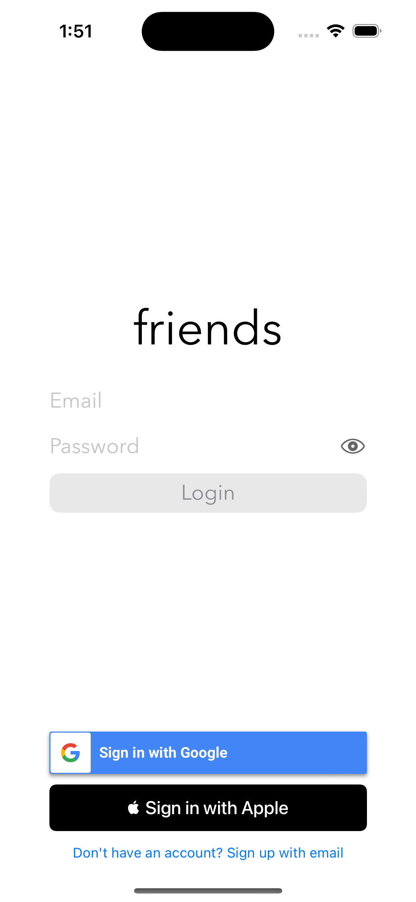

## Introduction

As I grew older, I noticed that work, school, and life in general became more demanding; to build the future that I envisioned for myself, I needed to work harder and harder to start my career off on the right foot. However, grinding came at the cost of my relationships; the more I worked, the more I pushed others aside, and the more depressed I became.

I knew I needed to find a better balance between work and my personal life. On top of that, with how competitive the CS field is, I also needed a way to stand out. So, I decided to create a project that could help me tackle both of these challenges.

My idea was simple: create a social app that helps maintain relationships. The basic concept was that users could create a profile, add their friends, and set up reminders to check in on them. This way, I could stay connected with friends and family without worrying about forgetting.

Initially, it seemed pretty basic, so I decided to leverage the power of LLMs to create more personalized and advanced plans tailored to the specific person I’m hanging out with. After all, everyone is different, with unique preferences and interests, so it made sense to make the experience more customized. The app would store all the "hangouts" you've had with people, feed this data into an LLM, and provide specialized suggestions based on past interactions.

The app is written in Swift and uses Firebase for backend services like authentication, Firestore for managing user and hangout data, and Cloud Storage. I’m also integrating LLMs into the app, using Firebase to handle data processing and storage, making it a seamless and scalable solution.

## Why Firebase?

Firebase is Google's mobile development platform that enables quick deployment and scalability, making it an easy choice for my app. It integrates seamlessly with Google Cloud products like Cloud Firestore, Cloud Functions, and Cloud Storage, allowing both server and client SDKs to access the same data, which simplifies front-end and back-end integration. Additionally, Firebase and Google Cloud share unified billing, charged on a pay-as-you-go basis. Currently, my project is small and fits within Firebase's [free tier](https://firebase.google.com/docs/projects/billing/firebase-pricing-plans), but planning for scalability now ensures a smooth transition as the app grows.

### Firebase Authentication

Authentication is a critical component of any application, ensuring secure and seamless access for users. I chose Firebase Authentication because it supports various sign-in methods, including email/password, Google, and Apple, which makes onboarding flexible and user-friendly. With Firebase, I can easily manage user sessions, handle password resets, and integrate secure authentication flows with minimal setup. This not only speeds up development but also provides robust security features like OAuth tokens and multi-factor authentication, giving users peace of mind while keeping their accounts safe. Below is an image demonstrating how Firebase Authentication integrates with my Swift app:

